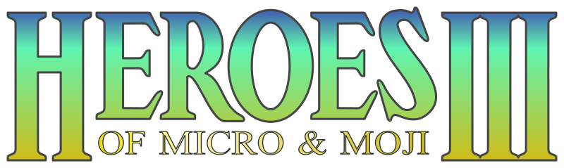
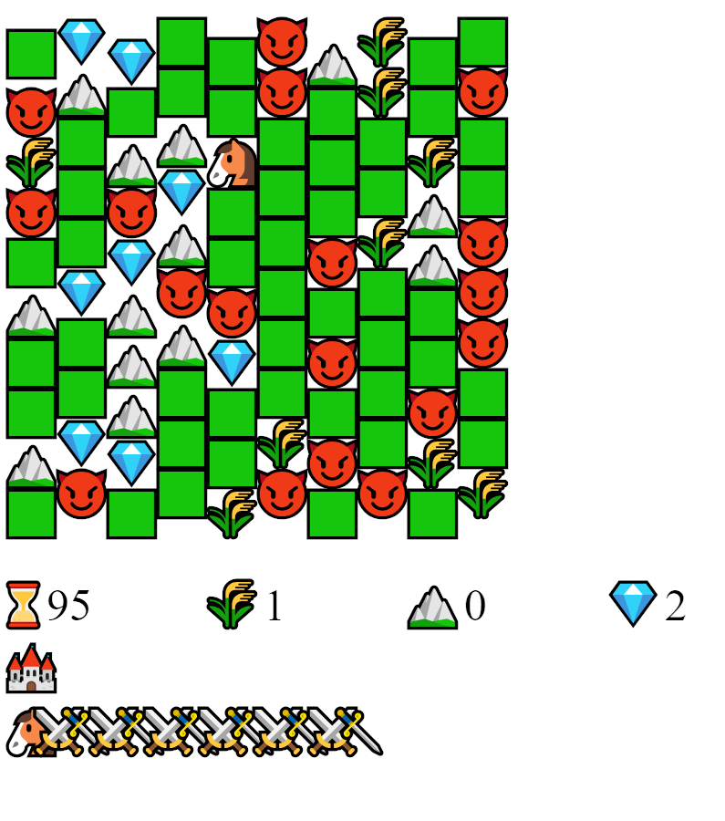
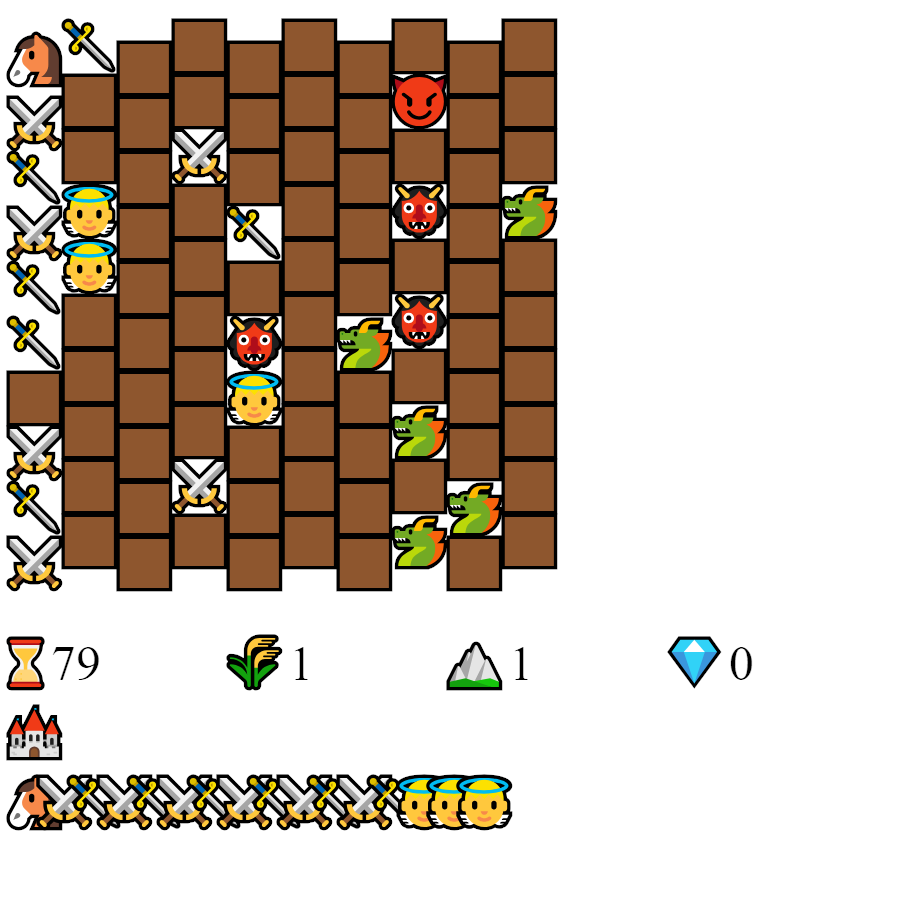
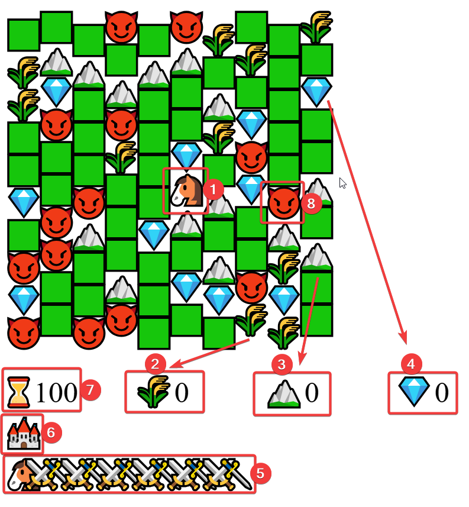
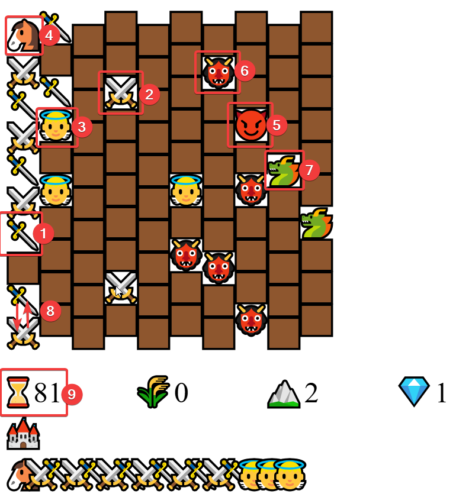

# Heroes of Micro & Moji III

<div align="center"><p></p></div><div align="center" style="font-weight:bold">A squashed tribute to the HOMM3 fantasy strategy game in 1 kb of printable JS code.</div>

---

<div align="center"><a href="https://www.kesiev.com/homm3/">Play</a> | <a href="https://discord.gg/TeAWvnuGku">Discord</a></div>

---

## The project

**HOMM3** is a [code golfed](https://it.wikipedia.org/wiki/Code_golf) and unfaithful demake of the 1999 fantasy strategy game [Heroes of Might and Magic 3](https://en.wikipedia.org/wiki/Heroes_of_Might_and_Magic_III). Sadly, the _might_ have been stripped down to fit into the _micro_ code. And the _magic_ is nearly gone, but hey... there are a lot of _emojis_!

<div align="center" style="margin:60px 0">
    <p></p>
    <p>There is a hexagonal overworld map with a horse to move around, resources to get, monsters to fight, a city to build, and even an army to hire and guide!</p>
</div>

Why? When I was younger, I used to play arcade games and avoided strategy games, as I thought they were way too boring.

Now I'm getting ~~older~~ wiser and, after playing and enjoying board games for some years, I discovered that some old-school computer strategy games were incredibly similar to modern board games.

I've found HOMM3 the perfect example: let's celebrate changing ideas, being wrong, and cool strategy games squashing some code!

<div align="center" style="margin:60px 0">
    <p></p>
    <p>There even are some kind of turn-based battles on a hex map, with demons, dragons, angels, and your (unuseful) horse on the top left!</p>
</div>

I've used no compression, so the game code is readable and printable. You can print it on a T-shirt and use it as an emergency game if you feel the urge of a horse and an army running around a hex board.

```
<canvas id=C><script>N=Math.random,S="🟩,🗡️,⚔️,👼,🐴,⌛,🌾,⛰️,💎,🐲,👹,😈,🟫".split`,`
,U=S[H="map"](((d,t)=>L=t?t%2+1:4)),(B=d=>{A=Array(Z).fill(M[0]=I=P=0),U[H](((d,t)=>{A[99-t]
=[0,9,G,11][4*N(A[t]=d)|0]})),F=(T=!T)?A:M})(F=M=Array(Z=100).fill(G=10)[H]((d=>N(T=D=55)>.5
&&[6,7,8,11][4*N(O=[Z,0,0,0])|0]))),( C.onclick=C.onmousemove=e=> {t=z=e.offsetY,d=F[p=(x=e.
offsetX/D|0)*G+(y=(z-(x%2?G:30))/D|0)],p&&(e.type[6]?P&&P-p&&(d<9? (d>4&&(O[d-5]+=L,d=0),F[p
]=F[P], F[P]=d):d>8&&(F[p]=(d+1)%12,T?(O[0]+=d,F[p]&&F[P]--):B()),O[b=P=0]-=L,t=I=(I+1)%3):d
&&d<5?P=p:!T&&y>G&&(y>11?O[H]((d=>z&=d>=L))&&z&&(O=O[H]((d=>d-L)),L++):O[r=x/4|0]*r&&(O[r]--
,U.push(r)))),u=[],A[H](((p,e)=>{p>8&&N(v=A[d=e-G+2*N(b=1)|0])-.3&&d&!t&&(v&&v<5?--A[d]&&(A[
e]=( A[e]+1)%12):( A[d]=p,A[e]=0)),p&&p<5&&u.push(p)})),b|| B(U=u),C.width=C.height=900,X=C.
getContext`2d`,X.font="50px A",F[H](((d,t)=>X[E="fillText"](S[d||12*T],(x=t/G|0)*D,t%G*D+(x%
2?D:77)+(t&&t-P&&9)))),O[H](((d,t)=>X[E](S[t+5]+O[t],t*D*4,680))),X[E]("🏰".repeat(L),0,750)
,U[H](((d,t)=>X[E](S[d],30*t,820)))})(M[D]=4)</script><!--    Heroes of Micro & Moji III -->
```

## Game guide

### Story

The kingdom of Javathia has been invaded by demons! Queen Rosalia must gather the people of her homeland and lead them against the evil that has ravaged their nation.

_Yeah. Right. You will also need a mouse._

## The Overworld View

<div align="center" style="margin:60px 0">
    <p></p>
</div>

Move Rosalia's horse (1) by clicking on it and moving the mouse to an adjacent cell. Moving her on resource cells, she will gather 🌾 Wheat (2), ⛰️ Stones (3), and 💎 Gems (4).

Clicking on their icons on the bottom bar you can produce new units to add to Rosalia's army (5): 1 Wheat for a 🗡️ Pikeman, 1 Stone for a ⚔️ Swordsman, and 1 Gem for an 👼 Angel.

You can also spend 1 Wheat, 1 Stone, and 1 Gem to add a 🏰 Castle to the city (6): Rosalia will gain +1 resource for each Castle in the city but it will also cost more Time (7) moving any unit on the map. It will also cost you 1 extra resource of each type to add another Castle to the city.

You must eliminate all the 😈 Demon's army from the map to get your best Time (7). Moving Rosalia on a Demon 😈 cell, the battle will start!

### The Battlefield View

<div align="center" style="margin:60px 0">
    <p></p>
</div>

When a battle starts, the map switches to the Battlefield view.

Rosalia's army units will appear on the left side of the battlefield and the demon's army will appear on the right side.

You can move Rosalina's 🗡️ Pikeman (1), ⚔️ Swordsman (2), and 👼 Angel (3) the same way you moved Rosalia's horse: click on a unit and move the mouse to an adjacent cell. Rosalia will give commands to her units and won't move during the battle (4).

Demon's army units will move after your army's first 2 movements, and then every 3 movements. Demon's army movement is unpredictable, you've been warned!

Demon soldiers are 😈 Imp (5), 👹 Devil (6), and 🐲 Dragon (7). Units have different rank values:

| Rank | Rosalia army | Demon army |
|---|---|---|
| 1 | 🗡️ Pikeman | 😈 Imp |
| 2 | ⚔️ Swordsman | 👹 Devil |
| 3 | 👼 Angel | 🐲 Dragon |

When a unit moves to an opponent unit cell, it will attack it reducing that unit's rank by 1. If a unit rank hits 0, the unit is killed and removed from the battlefield but, if it survives, it will attack back reducing the attacking unit rank by 1. Some examples:

 - If an 👼 Angel attacks a 👹 Devil, it will turn it into a 😈 Imp - which will attack back, turning the Angel into a ⚔️ Swordsman.
 - If a ⚔️ Swordsman attacks a 👹 Devil, it will turn the Devil into a 😈 Imp - which will attack back, turning the Swordsman into a 🗡️ Pikeman.
 - Directly attacked 🗡️ Pikeman and 😈 Imp will always die without attacking back, as they are rank 1 and they will hit rank 0 when attacked.

You can also swap your units in the battlefield moving one unit to another unit cell (8).

Rosalia will gain Time (9) every time one of her units attacks or kills an enemy unit.

The battle ends when all Rosalia loses all of her units or the Demons are defeated. If the battle ends with Rosalia's victory, the game goes back to the Overworld view, and the Demon army is eliminated.

## Technical notes

The game should work without problems if run from a local file. You may need the `.htaccess` file if you want to host it on the web.

## Credits

Thanks to _Bianca_ for sharing the dice, mouse, and gamepads in all these years.
